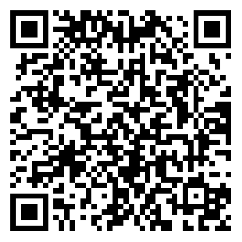

# @snewbie/salt-ui-vue

<a href="https://www.npmjs.com/package/@snewbie/salt-ui-vue"></a> <a  href="https://www.npmjs.com/package/@snewbie/salt-ui-vue"></a>

一个 [Salt UI](https://github.com/Moriafly/SaltUI) 风格的移动端 Vue 3 组件库。

# 安装

在现有项目中使用 Salt UI 时，可以通过 npm 进行安装：

``` bash
# Vue 3 项目，安装最新版 Salt UI
npm i @snewbie/salt-ui-vue
```

当然，你也可以通过 yarn 或 pnpm 或 bun 进行安装：

``` bash
# 通过 yarn 安装
yarn add @snewbie/salt-ui-vue

# 通过 pnpm 安装
pnpm add @snewbie/salt-ui-vue

# 通过 bun 安装
bun add @snewbie/salt-ui-vue
```

## 快速上手

```js
import { createApp } from 'vue';
// 1. 引入你需要的组件
import { SaltTextButton } from '@snewbie/salt-ui-vue';
// 2. 引入组件样式
import '@snewbie/salt-ui-vue/style.css';
import '@snewbie/salt-ui-vue/theme/variables.css';

const app = createApp();

// 3. 注册你需要的组件
app.use(SaltTextButton);
```


# 手机预览

可以手机扫码以下二维码访问手机端 demo：

